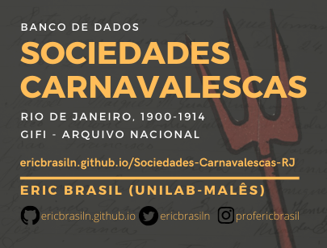

Autor: __Eric Brasil__

 *Banco de dados produzido a partir da documentação do GIFI-AN: pedidos de licenças de sociedades carnavalescas entre 1900 e 1914.*

**A ferramenta foi desenvolvida apenas para pesquisas acadêmicas, sem fins lucrativos.**

## Índice
- [Introdução](#introdução);
- [Pesquisa](#pesquisa);
  - [Fontes](#fontes);
- [Banco de dados](#banco-de-dados);
  - [Uso e funcionalidade](#uso-e-funcionalidade);
- [Questões técnicas e História Digital](#questões-técnicas-e-história-digital);
- [Contato, dúvidas e parcerias](#contato-dúvidas-e-parcerias);
- [Licença](#licensa)
____
## Introdução:
A publicização desse banco de dados visa tornar acessível a qualquer pessoa parte dos dados produzidos na pesquisa de doutorado entre 2012 e 2016.
Ele foi pensado como um recurso para pesquisas em história social da cultura da cidade do Rio de Janeiro no início do século XX. 
A criação do banco de dados público e pesquisável é fruto das reflexões e experiências empíricas de historiadores e sociológos que têm enfrentado o [desafio de fazer ciências humanas no mundo digital](http://bibliotecadigital.fgv.br/ojs/index.php/reh/article/view/79933).
Defendemos a importância da apropriação, uso, desenvolvimento e aprimoramento de ferramentas
digitais para as humanidades, assim como a urgência na sofisticação teórica, metodológica e epistemológica sobre as chamadas Humanidades Digitais e especialmente sobre História Digital.

## Pesquisa:
A tese de doutarado, proveniente dessa pesquisa, intitulada [*Carnavais Atlânticos: cidadania e cultura negra no pós-abolição. Rio de Janeiro e Port-of-Spain, Trinidad (1838-1920)*](https://www.academia.edu/25758607/Carnavais_Atl%C3%A2nticos_cidadania_e_cultura_negra_no_p%C3%B3s-aboli%C3%A7%C3%A3o._Rio_de_Janeiro_e_Port-of-Spain_Trinidad_1838-1920_), teve como objetivo principal analisar transnacionalmente experiências de mobilização negra através dos carnavais das cidades do Rio de Janeiro e de Port-of-Spain, Trinidad entre 1838 e 1920. Busquei compreender a atuação de sujeitos negros em sociedades tão distintas e como elaboraram estratégias de ação pública, de organização social e de reivindicação de direitos e cidadania no Pós-Abolição, tendo o carnaval como elemento que catalisou e potencializou suas experiências. A pesquisa esteve preocupada em refletir sobre termos de cidadania e cultura negra num contexto urbano influenciado pela diáspora africana, pela abolição da escravidão e pelo racismo. Para tanto, foram utilizadas fontes diversas referentes às duas cidades. No Rio de Janeiro pesquisei os periódicos preservados na Biblioteca Nacional, a documentação policial e de outros órgãos oficiais no Arquivo Nacional, os Diários Oficiais da União, além da vasta produção de memorialistas, folcloristas e historiadores. Para Port-of-Spain, as fontes primárias analisadas foram aquelas arquivadas na British Library, no National Archives e no King’s College em Londres, Inglaterra. Assim como no Rio, memorialistas, folcloristas e a produção historiográfica foram fundamentais na pesquisa. A tese foi dividida em três partes: a primeira sobre os carnavais negros no Rio, a segunda sobre os carnavais negros de Port-of-Spain e a terceira, e conclusiva, apresenta a análise comparativa transnacional. Seu recorte cronológico respondeu ao período Pós-Abolição em cada cidade – a partir das décadas de 1840 e 1890, em Port-of-Spain e no Rio, respectivamente. Com essa estrutura, e ao final do trabalho, pude demonstrar o quanto estratégias de mobilização negra em ambas as cidades do Atlântico estiveram dialogando com variadas forças de suas sociedades – especialmente imprensa e polícia –, e produzindo caminhos de valorização, reconhecimento, autonomia, cidadania através de experiências onde o carnaval representou um papel fundamental em sua ação coletiva.
### Fontes:
O primeiro conjunto de fontes trabalhado na pesquisa consiste nos pedidos de licença e documentação policial referentes à sociedades recreativas do Rio de Janeiro, preservadas no fundo GIFI do Arquivo Nacional. 

O Grupo de Identificação de Fundos Internos - GIFI -, segundo o [site do Arquivo Nacional](http://dibrarq.arquivonacional.gov.br/index.php/diversos-gifi-caixas-e-codices), "foi formado em 1981, com o objetivo de identificar o acervo documental da antiga Seção do Poder Executivo que não tinha sofrido tratamento técnico - cerca da quinta parte do acervo da Seção." Nele encontramos inúmeras pastas sobre pedidos de licenças de associações carnavalescas. 

Esses pedidos de licença forneceram um conjunto rico de dados qualitativos e quantitativos para a pesquisa, contendo nomes, endereços, profissões, estatutos, além da movimentação e argumentação das forças policiais sobre a concessão ou não das licenças solicitadas.

## Banco de dados:
O banco de dados foi inicialmente elaborada em Access e recentemente transformado em CSV para melhor visualização, pesquisa e compartilhamento.
O Banco de dados Sociedades Carnavalescas possui 1178 entradas, contendo as seguintes colunas: 
- Código;
- Nome da Sociedade;
- Data (do pedido);
- Endereço (da associação);
- Licença (se é um pedido de licença);
- Estatuto (se consta estatuto);
- Notação-GIFI;
- Tipo de licença;
- Obs (comentários breves da época da pesquisa);
- Presidente (se há registro);
- Licença anterior (se há registro);
- Nomes/Sujeitos (quando há referência aos membros ou diretoria);
- Doc policial (se é um documento interno da polícia)

### Uso e funcionalidade:
No site é possível pesquisar os termos desejados, escolher a quantidade de registros visíveis por páginas, ordenar por qualquer coluna e fazer download do arquivo CSV completo.

__Atenção: como o arquivo é grande, pode demorar alguns segundos para carregar o banco de dados na tela. Por favor, aguarde.__

## Questões técnicas e História Digital:
A utilização de linguagem de programação entre outras técnias e métodos digitais tem se tornado cada vez mais eficiente e imprescindível para as pesquisas em humanidades. 

Tenho buscado avançar nas reflexões teóricas, metodológicas e epistemológicas das ferramentas digitias de pesquisa para a disciplina História, atuando no [curso de História](http://historia.males.unilab.edu.br/) da Unilab, campus dos Malês e no [Laboratório de Humanidades Digitais da Ufba](http://labhd.ufba.br/). 

Para o caso do banco de dados Sociedades Carnavalescas, utilizei Python3.8 para manipular o CSV.

O arquivo CSV com todas as informações do banco de dados foi convertido para html através do código desenvolvido por [Derek Eder](https://github.com/derekeder/csv-to-html-table) e armazenado no Github e hospedado em meu site pessoal gerado com Github Pages.

O código é livre e aberto para ser utilizado.

## Como citar?
BRASIL, Eric. *Sociedades Carnavalescas, RJ, 1900-1914 - GIFI/AN: banco de dados*. 2020. Disponível em <https://ericbrasiln.github.io/Sociedades-Carnavalescas-RJ/>. Acesso em 04 de jun. 2020.

## Contato, dúvidas e parcerias
- [__Twitter__](twitter.com/ericbrasiln)
- [__Instagram__](https://www.instagram.com/profericbrasil/)
- __E-mail__: profericbrasil@unilab.edu.br

## Licensa
The MIT License (MIT)
